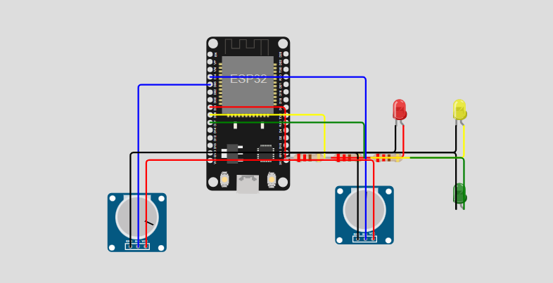

# FIAP - Faculdade de Informática e Administração Paulista

<p align="center">
<a href= "https://www.fiap.com.br/"></a>
</p>

<br>

# Sistema de Apoio à Tomada de Decisão e Gestão de Logística para Ajuda Humanitária Pós-Desastre

## 👨‍🎓 Integrantes: 
- <a href="https://www.linkedin.com/in/anacornachi/">Ana Cornachi</a>
- <a href="https://www.linkedin.com/in/carlamaximo/">Carla Máximo</a>
- <a href="https://www.linkedin.com/in/lucas-lins-lima/">Lucas Lins</a> 

## 👩‍🏫 Professores:
### Tutor(a) 
- <a href="https://www.linkedin.com/in/lucas-gomes-moreira-15a8452a/">Lucas Gomes Moreira</a>
### Coordenador(a)
- <a href="https://www.linkedin.com/in/andregodoichiovato/">André Godoi Chiovato</a>

## 📜 Descrição

O **Sistema de Apoio à Tomada de Decisão e Gestão de Logística para Ajuda Humanitária Pós-Desastre** é uma solução digital inovadora desenvolvida para enfrentar um dos maiores desafios em situações de desastres naturais: a otimização da distribuição de recursos essenciais e o resgate de pessoas em áreas afetadas.

### Contexto e Problema

Após eventos naturais extremos, como inundações, terremotos ou deslizamentos de terra, comunidades inteiras podem ficar isoladas, com acesso limitado a recursos vitais como água potável, alimentos e medicamentos. A infraestrutura de transporte é frequentemente danificada, criando um cenário complexo para as equipes de resposta a desastres.

Os principais desafios incluem:
- **Priorização de áreas críticas**: Determinar quais localidades precisam de assistência mais urgente
- **Roteirização eficiente**: Encontrar caminhos viáveis quando muitas rotas estão bloqueadas
- **Alocação otimizada de recursos**: Distribuir suprimentos limitados de forma a maximizar o impacto humanitário
- **Adaptação a mudanças rápidas**: Replanejar operações quando novas informações sobre status de rotas surgem

### Nossa Solução

Nosso sistema aborda esses desafios através de uma combinação de tecnologias:

1. **Machine Learning para Classificação de Criticidade**: Utilizamos algoritmos de clustering (K-means) para classificar áreas afetadas em diferentes níveis de criticidade, considerando fatores como:
   - Número de pessoas afetadas
   - Nível de água na região
   - Necessidades específicas (água, alimentos, medicamentos)
   - Tempo desde o último abastecimento

2. **Modelagem de Rede de Transporte com Grafos**: Representamos toda a rede de rotas como um grafo matemático, onde:
   - Nós representam áreas afetadas e centros de distribuição
   - Arestas representam rotas disponíveis
   - Pesos das arestas indicam tempo de percurso
   - Atributos das arestas incluem status das rotas (livre, parcial, bloqueada)

3. **Algoritmos de Otimização de Rotas**: Implementamos algoritmos de caminho mais curto para determinar as melhores rotas, considerando:
   - Status atual das vias (bloqueadas, parcialmente bloqueadas ou livres)
   - Prioridade das áreas a serem atendidas
   - Capacidade de transporte disponível

4. **Monitoramento em Tempo Real com ESP32**: Utilizamos microcontroladores ESP32 equipados com sensores para:
   - Monitorar condições das rotas (nível de água, bloqueios)
   - Transmitir dados em tempo real para o sistema central
   - Possibilitar a atualização dinâmica do plano logístico

5. **Sistema de Alocação Inteligente de Recursos**: Desenvolvemos um algoritmo que:
   - Prioriza áreas com maior criticidade
   - Considera os recursos disponíveis em cada centro de distribuição
   - Otimiza a distribuição para maximizar o número de pessoas atendidas
   - Gera planos de entrega detalhados com rotas, recursos e tempos estimados

## 🖼️ Diagrama de Sensores ESP32

Abaixo está a configuração do nosso sensor ESP32 no simulador Wokwi, mostrando a conexão dos potenciômetros e LEDs para monitoramento de status de rotas:



### Componentes do Sensor:
- **ESP32**: Microcontrolador principal
- **Potenciômetro 1**: Simula o sensor de bloqueio de estrada (conectado ao pino 34)
- **Potenciômetro 2**: Simula o sensor de nível de água (conectado ao pino 35)
- **LED Vermelho**: Indica estrada bloqueada (conectado ao pino 25)
- **LED Amarelo**: Indica estrada com restrições (conectado ao pino 26)
- **LED Verde**: Indica estrada livre (conectado ao pino 27)

## 📂 Estrutura do Projeto

### Diagrama de Pastas e Arquivos

```
sistema-logistica-humanitaria/
├── .github/                       # Configurações do GitHub
│
├── assets/                        # Recursos visuais
│   ├── logo-fiap.png
│   └── esp32_wokwi_setup.png      # Imagem do setup do ESP32
│
├── config/                        # Arquivos de configuração
│
├── document/                      # Documentação do projeto
│   └── other/                     # Documentação complementar
│
├── scripts/                       # Scripts auxiliares
│
├── src/                           # Código-fonte do projeto
│   ├── data/                      # Módulos de dados
│   │   ├── __init__.py
│   │   └── data_generator.py      # Gerador de dados simulados
│   │
│   ├── models/                    # Algoritmos e modelos
│   │   ├── __init__.py
│   │   ├── criticality_classifier.py  # Classificação ML de áreas críticas
│   │   ├── route_network.py       # Modelagem de rede de rotas
│   │   └── resource_allocator.py  # Algoritmo de alocação de recursos
│   │
│   ├── api/                       # Integrações externas
│   │   ├── __init__.py
│   │   └── sensor_integration.py  # Integração com ESP32
│   │
│   ├── utils/                     # Utilitários
│   │   └── __init__.py
│   │
│   ├── visualization/             # Visualizações geradas
│   │
│   ├── esp32/                     # Código para ESP32
│   │   └── road_sensor.ino        # Código Arduino para ESP32
│   │
│   └── main.py                    # Script principal
│
├── .gitignore                     # Arquivos ignorados pelo Git
├── .gitattributes                 # Configurações de atributos Git
├── requirements.txt               # Dependências do projeto
└── README.md                      # Este arquivo
```

## 📁 Estrutura de pastas

Dentre os arquivos e pastas presentes na raiz do projeto, definem-se:

- **`.github`**: Nesta pasta ficarão os arquivos de configuração específicos do GitHub que ajudam a gerenciar e automatizar processos no repositório.

- **`assets`**: aqui estão os arquivos relacionados a elementos não-estruturados deste repositório, como imagens.

- **`config`**: Posicione aqui arquivos de configuração que são usados para definir parâmetros e ajustes do projeto.

- **`document`**: aqui estão todos os documentos do projeto que as atividades poderão pedir. Na subpasta "other", adicione documentos complementares e menos importantes.

- **`scripts`**: Posicione aqui scripts auxiliares para tarefas específicas do seu projeto. Exemplo: deploy, migrações de banco de dados, backups.

- **`src`**: Todo o código fonte criado para o desenvolvimento do projeto ao longo das 7 fases.

- **`README.md`**: arquivo que serve como guia e explicação geral sobre o projeto (o mesmo que você está lendo agora).

## 🔬 Componentes Técnicos Detalhados

### 1. Gerador de Dados Simulados

O módulo `data_generator.py` cria conjuntos de dados realistas que simulam um cenário pós-desastre:

- **Áreas Afetadas**: Localidades com diferentes níveis de impacto, população e necessidades
- **Rotas de Acesso**: Conexões entre áreas com atributos de distância, tempo e status
- **Centros de Distribuição**: Pontos com estoques de recursos e capacidade logística
```
python
# Exemplo de uso
generator = DataGenerator()
dados = generator.gerar_todos_dados()
```
### 2. Classificador de Criticidade

O módulo criticality_classifier.py implementa um algoritmo de Machine Learning (K-means) para classificar áreas afetadas em três níveis de criticidade (alta, média, baixa) com base em múltiplos fatores:
```
# Exemplo de uso
classifier = CriticalityClassifier()
areas_classificadas = classifier.classificar_areas()
```
### 3. Modelagem de Rede de Rotas

O módulo route_network.py cria um grafo matemático representando toda a rede de transporte, permitindo:
- Análise de conectividade entre áreas
- Visualização da rede
- Base para algoritmos de otimização de rotas
```
# Exemplo de uso
network = RouteNetwork()
G = network.criar_rede()
network.visualizar_rede('mapa_logistico.png')
```

### 4. Alocador de Recursos

O módulo resource_allocator.py implementa algoritmos de otimização para distribuir recursos limitados entre áreas afetadas, considerando:
- Nível de criticidade
- Disponibilidade de recursos
- Rotas acessíveis
- Capacidade de transporte
```
# Exemplo de uso
allocator = ResourceAllocator()
plano = allocator.alocar_recursos()
```

### 5. Integração com Sensores ESP32

O módulo sensor_integration.py processa dados dos sensores ESP32 e atualiza o modelo de rede em tempo real:
```
# Exemplo de uso
integration = SensorIntegration()
dados_coletados = integration.monitorar_simulado(intervalo_segundos=3, num_atualizacoes=2)
```

### 6. Sistema Principal

O script main.py integra todos os componentes em um fluxo de execução coeso:
```
# Exemplo de uso
system = HumanitarianLogisticsSystem()
system.executar_simulacao_completa()
```

## 🔧 Como executar o código

Para visualizar e executar este projeto, siga as instruções abaixo:

### Pré-requisitos
- Python 3.10+
- Pip (gerenciador de pacotes Python)
- Simulador Wokwi (para o ESP32)

### Passo a passo para execução

1. Clone o repositório ou baixe o arquivo .zip pelo próprio GitHub e extraia no seu computador.
```
git clone https://github.com/lucas-lins-lima/FIAP_F3_CAP14.git
```
2. Crie e ative um ambiente virtual:
```
# Windows
python -m venv venv
venv\Scripts\activate

# Linux/Mac
python -m venv venv
source venv/bin/activate
```
3. Instale as dependências:
```
pip install -r requirements.txt
```
4. Acesse a pasta do projeto
```
cd FIAP_F3_CAP14
```
5. Execute o sistema em um dos seguintes modos:
```
# Simulação completa
python src/main.py --full

# Apenas inicialização do sistema
python src/main.py --init

# Simulação de atualização do sensor
python src/main.py --sensor
```
## 🧪 Testando o Sistema

Para verificar o funcionamento correto do sistema, siga estes passos:

1. Teste da geração de dados:
```
python -m src.data.data_generator
```
Isto gerará os arquivos CSV na pasta src/data/.

2. Teste do classificador de criticidade:
```
python -m src.models.criticality_classifier
```
Verifique o arquivo areas_afetadas_classificadas.csv gerado.
3. Teste da modelagem de rede:
```
python -m src.models.route_network
```
Observe a visualização da rede gerada em src/visualization/.
4. Teste do alocador de recursos:
```
python -m src.models.resource_allocator
```
Analise o plano logístico gerado.

5. Teste da integração com sensores:
```
python -m src.api.sensor_integration
```

## 🛠️ Configuração do ESP32 no Wokwi

1. Abra o link: https://wokwi.com/projects/432388135483191297
2. Execute o código
3. Observe como os LEDs mudam com base nos valores dos potenciômetros:
   - Potenciômetro 1 alto ou 2 alto = LED Vermelho (rota bloqueada)
   - Potenciômetros em valor médio = LED Amarelo (rota com restrições)
   - Potenciômetros em valor baixo = LED Verde (rota livre)

## 📊 Resultados e Visualizações

O sistema gera várias visualizações e resultados que ajudam a compreender o cenário e as decisões tomadas:

1. Mapa da Rede Logística: Visualização gráfica da rede de rotas, com:
   - Áreas codificadas por cores conforme criticidade
   - Centros de distribuição destacados
   - Status das rotas indicado
2. Plano Logístico: Detalhamento das entregas planejadas, incluindo:
   - Priorização baseada em criticidade
   - Recursos alocados para cada área
   - Rotas otimizadas
   - Tempos estimados de percurso
3. Atualizações em Tempo Real: Visualizações que mostram como o sistema se adapta às mudanças no status das rotas.

## 🚀 Aplicações e Impacto

Este sistema pode ser aplicado em diversos cenários reais:
- Coordenação de Ajuda Humanitária: Organizações como Cruz Vermelha e Defesa Civil podem utilizar o sistema para otimizar operações.
- Gestão de Desastres Naturais: Governos podem implementar a solução como parte de protocolos de resposta a eventos extremos.
- Planejamento Preventivo: Simulações podem ser executadas previamente para diferentes cenários, preparando planos de contingência.

O impacto potencial inclui:
- Redução no tempo de resposta a comunidades isoladas
- Melhor alocação de recursos escassos
- Atendimento prioritário às áreas mais críticas
- Adaptação rápida a mudanças nas condições de acesso

## 🗃 Histórico de lançamentos

* 0.1.0 - 30/05/2024
    * Configuração inicial do ambiente de desenvolvimento
    * Estruturação do projeto
    * Implementação da geração de dados simulados
    * Integração com ESP32 (simulado no Wokwi)

## 📋 Licença

<p xmlns:cc="http://creativecommons.org/ns#" xmlns:dct="http://purl.org/dc/terms/"><a property="dct:title" rel="cc:attributionURL" href="https://github.com/agodoi/template">MODELO GIT FIAP</a> por <a rel="cc:attributionURL dct:creator" property="cc:attributionName" href="https://fiap.com.br">Fiap</a> está licenciado sobre <a href="http://creativecommons.org/licenses/by/4.0/?ref=chooser-v1" target="_blank" rel="license noopener noreferrer" style="display:inline-block;">Attribution 4.0 International</a>.</p>
